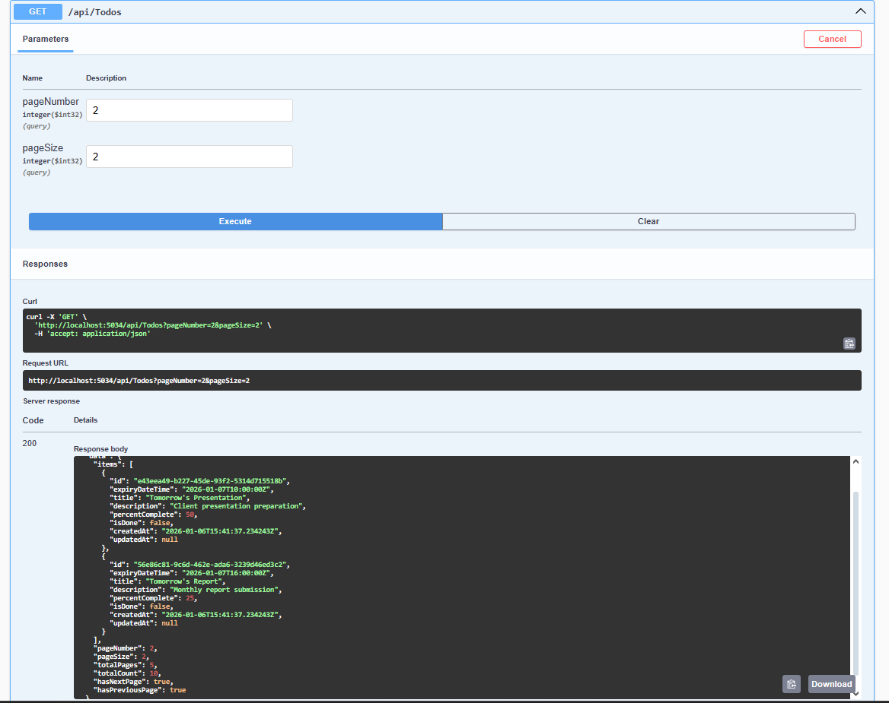
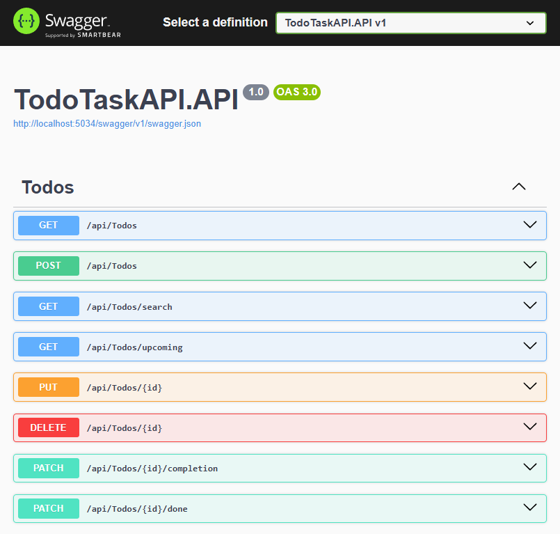

# 📋 Todo Task API

[](https://github.com/JakubPatkowski/TodoTaskApi/actions/workflows/ci.yml)
[](https://codecov.io/gh/JakubPatkowski/TodoTaskApi)
[](https://github.com/JakubPatkowski/TodoTaskApi/actions/workflows/codeql.yml)
[](https://github.com/JakubPatkowski/TodoTaskApi/actions/workflows/docker-publish.yml)
[](https://dotnet.microsoft.com/)
[](https://www.postgresql.org/)
[](https://www.docker.com/)
[](https://opensource.org/licenses/MIT)
[](https://github.com/JakubPatkowski/TodoTaskApi/releases)

## 📊 Code Coverage

[](https://codecov.io/gh/JakubPatkowski/TodoTaskApi)


> Production-ready REST API for todo management built with .NET 8, Clean Architecture, Testcontainers, Docker, and comprehensive testing.

##  Screenshoots


Frontend Main Page


Frontend Main Page


## 🏆 Highlights

This project demonstrates **production-ready practices** beyond typical CRUD tutorials:

| Feature | Implementation |
|---------|---------------|
| **Real Database Testing** | Integration tests run against actual PostgreSQL using [Testcontainers](https://testcontainers.com/) — not in-memory fakes |
| **Full HTTP Testing** | Tests execute real HTTP requests through `WebApplicationFactory` |
| **Rate Limiting** | Custom token bucket algorithm with HTTP 429 responses and `Retry-After` headers |
| **Resilient Patterns** | Polly retry policies with exponential backoff |
| **Clean Architecture** | Strict 4-layer separation with dependency injection |
| **CI/CD Pipeline** | GitHub Actions with PostgreSQL service container |
| **Security Scanning** | Automated CodeQL analysis on every push |
| **Code Coverage** | Codecov integration with coverage reports |

## ✨ Features

- **Full CRUD Operations** — Create, Read, Update, Delete todos
- **Advanced Queries** — Search by ID/title, filter upcoming tasks (today/week/custom periods)
- **Partial Updates** — Update completion percentage or mark as done separately
- **Pagination Support** — Efficient handling of large datasets with metadata
- **Rate Limiting** — Token bucket algorithm protecting API from abuse
- **Docker Ready** — One-command deployment with Docker Compose
- **Comprehensive Testing** — Unit and integration tests with real PostgreSQL
- **API Documentation** — Interactive Swagger/OpenAPI 3.0 documentation

## 🛠️ Tech Stack

| Category | Technology |
|----------|------------|
| **Framework** | .NET 8, ASP.NET Core Web API |
| **Database** | PostgreSQL 15+ with Entity Framework Core 8 |
| **Testing** | xUnit, Testcontainers, Moq, WebApplicationFactory |
| **Resilience** | Polly (retry policies with exponential backoff) |
| **Documentation** | Swagger / OpenAPI 3.0 |
| **Containerization** | Docker, Docker Compose |
| **CI/CD** | GitHub Actions |
| **Security** | CodeQL Analysis |
| **Coverage** | Codecov |

## 🏗️ Architecture

This project follows **Clean Architecture** principles with strict layer separation:

```
┌─────────────────────────────────────────────────────────────┐
│                       API Layer                             │
│           Controllers, Middleware, Swagger, DI              │
├─────────────────────────────────────────────────────────────┤
│                    Application Layer                        │
│              Services, DTOs, Validation                     │
├─────────────────────────────────────────────────────────────┤
│                       Core Layer                            │
│              Entities, Interfaces, Exceptions               │
├─────────────────────────────────────────────────────────────┤
│                   Infrastructure Layer                      │
│         EF Core DbContext, Repositories, Migrations         │
└─────────────────────────────────────────────────────────────┘
```

### Project Structure

```
src/
├── TodoTaskAPI.API/                 # Entry point, HTTP layer
│   ├── Controllers/                 # API endpoints
│   ├── Middleware/                  # Rate limiting, error handling, logging
│   └── Swagger/                     # API documentation config
├── TodoTaskAPI.Application/         # Business logic
│   ├── DTOs/                        # Data transfer objects
│   ├── Interfaces/                  # Service contracts
│   └── Services/                    # Service implementations
├── TodoTaskAPI.Core/                # Domain layer
│   ├── Entities/                    # Domain models
│   ├── Exceptions/                  # Custom exceptions
│   └── Interfaces/                  # Repository contracts
└── TodoTaskAPI.Infrastructure/      # Data access
    ├── Data/                        # DbContext, seed data
    ├── Migrations/                  # EF Core migrations
    └── Repositories/                # Repository implementations

tests/
├── TodoTaskAPI.IntegrationTests/    # Full-stack tests with real PostgreSQL
│   ├── Api/                         # API-level tests
│   ├── Database/                    # Database consistency tests
│   ├── Endpoints/                   # CRUD endpoint tests
│   ├── Health/                      # Health check tests
│   ├── Infrastructure/              # Testcontainers setup
│   └── Performance/                 # Rate limiting tests
└── TodoTaskAPI.UnitTests/           # Unit tests with mocks
    ├── Controllers/
    ├── DTOs/
    ├── Middleware/
    ├── Repositories/
    └── Services/
```

## 📖 API Endpoints

| Method | Endpoint | Description |
|--------|----------|-------------|
| `GET` | `/api/todos` | Get all todos (supports pagination) |
| `GET` | `/api/todos/search` | Search todos by ID or title |
| `GET` | `/api/todos/upcoming` | Get upcoming todos (today/tomorrow/week/custom) |
| `POST` | `/api/todos` | Create a new todo |
| `PUT` | `/api/todos/{id}` | Update existing todo |
| `DELETE` | `/api/todos/{id}` | Delete todo |
| `PATCH` | `/api/todos/{id}/completion` | Update completion percentage |
| `PATCH` | `/api/todos/{id}/done` | Mark todo as done/undone |

### Example Requests

```bash
# Get all todos with pagination
curl "http://localhost:5034/api/todos?pageNumber=1&pageSize=10"

# Get upcoming todos for today
curl "http://localhost:5034/api/todos/upcoming?period=Today"

# Create a new todo
curl -X POST "http://localhost:5034/api/todos" \
  -H "Content-Type: application/json" \
  -d '{"title":"Complete project","expiryDateTime":"2025-12-31T23:59:59Z"}'

# Update completion percentage
curl -X PATCH "http://localhost:5034/api/todos/{id}/completion" \
  -H "Content-Type: application/json" \
  -d '{"percentComplete": 75}'
```

## 🚀 Quick Start

### Using Docker (Recommended)

```bash
# Clone the repository
git clone https://github.com/JakubPatkowski/TodoTaskApi
cd TodoTaskApi

# Build and run with Docker Compose
docker-compose up --build
```

**That's it!** The API will be available at:
- 🌐 **API:** http://localhost:5034
- 📚 **Swagger:** http://localhost:5034/swagger

### 🐳 Pull from GitHub Container Registry

```bash
docker pull ghcr.io/jakubpatkowski/todotaskapi:latest
```

### Local Development

<details>
<summary>Click to expand local setup instructions</summary>

**Prerequisites:**
- [.NET SDK 8.0](https://dotnet.microsoft.com/download/dotnet/8.0)
- PostgreSQL 15+

**Configure database** — Create `appsettings.Development.json` in `src/TodoTaskAPI.API/`:

```json
{
  "ConnectionStrings": {
    "DefaultConnection": "Host=localhost;Database=TodoDb;Username=postgres;Password=postgres"
  },
  "Logging": {
    "LogLevel": {
      "Default": "Information",
      "Microsoft.AspNetCore": "Information"
    }
  }
}
```

**Run the application:**

```bash
dotnet run --project src/TodoTaskAPI.API
```

</details>

## 🐳 Docker Configuration

| File | Purpose |
|------|---------|
| `docker-compose.yml` | Production-ready configuration |
| `docker-compose.override.yml` | Development overrides (auto-merged by Docker) |
| `docker-compose.test.yml` | Testing with isolated database |
| `docker-compose.dcproj` | Visual Studio Docker Compose project |

```bash
# Development (auto-merges override)
docker-compose up --build

# Run tests in containers
docker-compose -f docker-compose.test.yml up --build
```

## 🧪 Testing

The project includes comprehensive test coverage with both unit and integration tests.

### Test Infrastructure

Integration tests use **Testcontainers** to spin up a real PostgreSQL database:

```csharp
// Real PostgreSQL in Docker
_dbContainer = new PostgreSqlBuilder()
    .WithImage("postgres:latest")
    .WithDatabase("TodoDb")
    .WithUsername("postgres")
    .WithPassword("postgres")
    .Build();
```

Tests execute through **WebApplicationFactory** for full HTTP stack testing:

```csharp
// Real HTTP requests through the entire pipeline
var response = await _client.PostAsJsonAsync("/api/todos", newTodo);
```

### Running Tests

```bash
# Run all tests
dotnet test TodoTaskApi.sln

# Run unit tests only
dotnet test tests/TodoTaskAPI.UnitTests/TodoTaskAPI.UnitTests.csproj

# Run integration tests only
dotnet test tests/TodoTaskAPI.IntegrationTests/TodoTaskAPI.IntegrationTests.csproj

# Run with coverage
dotnet test TodoTaskApi.sln --collect:"XPlat Code Coverage"

# Run with verbose output
dotnet test TodoTaskApi.sln --verbosity normal
```

### Test Categories

| Category | Description | Database |
|----------|-------------|----------|
| **Unit Tests** | Service logic, DTOs, middleware | Mocked |
| **Integration Tests** | Full API endpoint testing | Real PostgreSQL (Testcontainers) |
| **Performance Tests** | Rate limiting under load | Real PostgreSQL |
| **Health Tests** | Database connectivity, multi-client | Real PostgreSQL |

## 🔧 CI/CD Pipeline

GitHub Actions workflow automatically runs on every push and PR:

```yaml
jobs:
  build-and-test:
    services:
      postgres:  # Real PostgreSQL service container
        image: postgres:latest
    steps:
      - Build solution
      - Run Unit Tests with Coverage
      - Run Integration Tests
      - Upload Coverage to Codecov
```

### Workflows

| Workflow | Description | Trigger |
|----------|-------------|---------|
| **CI** | Build, test, coverage | Push/PR to main |
| **CodeQL** | Security scanning | Push/PR + weekly |
| **Docker** | Build & push to GHCR | Push to main + tags |
| **Release Drafter** | Auto release notes | PR merges |

View workflow runs: [Actions](https://github.com/JakubPatkowski/TodoTaskApi/actions)

## 🔒 Security

- **CodeQL Analysis** — Automated security scanning on every push and weekly
- **Dependabot** — Automatic dependency updates for NuGet, Docker, and GitHub Actions
- **Rate Limiting** — Token bucket algorithm protection against API abuse

## 🗄️ Database

Entity Framework Core handles all database operations with automatic migrations:

- Migrations applied automatically on startup
- Seed data for development environment
- Code-first approach with fluent configuration

No manual SQL scripts required!

## 🤝 Contributing

Contributions are welcome! Please feel free to submit a Pull Request.

1. Fork the repository
2. Create your feature branch (`git checkout -b feature/AmazingFeature`)
3. Commit your changes (`git commit -m 'Add some AmazingFeature'`)
4. Push to the branch (`git push origin feature/AmazingFeature`)
5. Open a Pull Request

## 📄 License

This project is licensed under the MIT License — see the [LICENSE](LICENSE) file for details.

---

<p align="center">
  Made with ❤️ by <a href="https://github.com/JakubPatkowski">Jakub Patkowski</a>
</p>